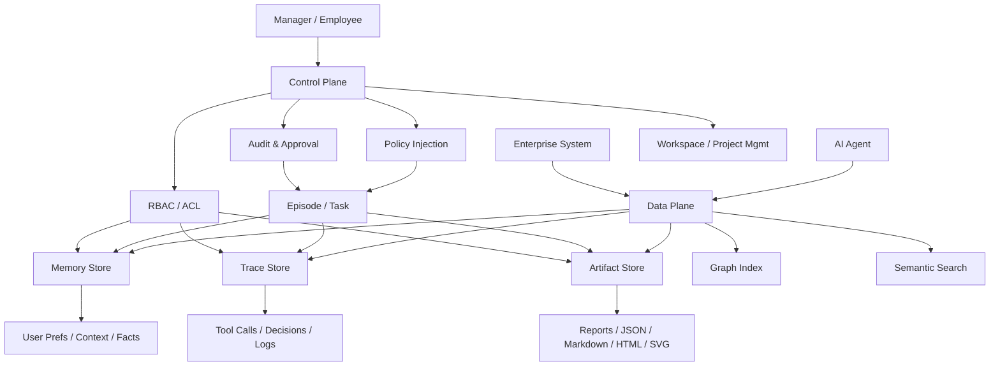

# Architecture

## 1. 架构原则
- 图谱优先，不是存储桶优先
- `Episode` 优先，不是会话优先
- `Episode-first` 视角优先，不是 `Project-first` 首页优先
- Agent 原生写入与查询优先，不是人工文档编辑优先
- 数据平面与控制平面分离
- 敏感数据分层处理
- 先做外部控制平面，再考虑自有 runtime

## 2. 系统视角

### 2.1 Data Plane
负责承载输入、过程、输出三类业务数据：

- Memory Store
- Trace Store
- Artifact Store
- Graph Index
- Semantic Search

### 2.2 Control Plane
负责企业治理和可管理性：

- Policy Injection
- RBAC / ACL
- Audit & Approval
- Workspace / Project Management

## 3. 核心对象模型

| 对象 | 用途 | 关键字段 |
| --- | --- | --- |
| Workspace | 企业或团队边界 | `workspace_id`, `name`, `owner_id` |
| Project | 业务项目边界 | `project_id`, `workspace_id`, `policy_set_id` |
| Agent | 受管理的 Agent 实体 | `agent_id`, `role`, `owner`, `capabilities` |
| Episode | 一次最小业务闭环 | `episode_id`, `project_id`, `goal`, `work_type`, `status` |
| MemoryItem | 输入型上下文 | `memory_id`, `episode_id`, `type`, `importance`, `ttl` |
| TraceEvent | 过程型节点 | `event_id`, `episode_id`, `step`, `tool`, `decision`, `result` |
| Artifact | 输出型产物 | `artifact_id`, `episode_id`, `file_type`, `uri`, `version` |
| Policy | 生效规则版本 | `policy_id`, `scope`, `version`, `ruleset` |
| AccessGrant | 授权记录 | `grant_id`, `subject_type`, `subject_id`, `scope`, `effect` |
| AuditEvent | 审计证据 | `audit_id`, `actor_type`, `action`, `target_type`, `target_id` |
| NodeEdge | 节点间关系 | `edge_id`, `from_node`, `to_node`, `edge_type` |

## 4. 关系模型
系统核心不是对象，而是对象之间的显式关系。

### 4.1 推荐关系边
- `belongs_to`
- `used_in`
- `generated_from`
- `approved_by`
- `restricted_by`
- `shared_with`
- `supersedes`
- `references`

### 4.2 Episode 关系
- `depends_on`
- `reviews`
- `supersedes`
- `continues`
- `splits_from`
- `references`

### 4.3 关系自动化默认值
- `depends_on = auto`
- `reviews = assisted`
- `supersedes = assisted`
- `continues = manual`
- `splits_from = manual`
- `references = manual`

### 4.4 关键约束
- 所有 Memory / Trace / Artifact 必须归属于 `episode`
- Artifact 必须至少能回链到一个 TraceEvent
- 任何受控读取都应能回链到 Policy 和 AccessGrant
- 审批动作本身也是图谱节点或事件，不能只存布尔值

## 5. 主流程

## 6. 数据流

### 6.1 写入流
1. Agent 创建 `episode`
2. 系统解析并附着生效的 `policy_version`
3. Agent 写入 `memory_item`
4. Agent 在执行过程中追加 `trace_event`
5. Agent 生成 `artifact`
6. 系统写入 `node_edges`
7. 系统为关键行为补写 `audit_event`

### 6.2 查询流
1. 调用方请求 `episode graph`
2. 权限系统检查 Workspace / Project / Episode / Node 访问权限
3. Graph 层返回节点、边、时间线和相关元数据
4. 对敏感节点按权限降级展示或拒绝访问
5. 查询行为本身写入审计

## 7. 存储抽象

### 7.1 MVP 技术组合
- Postgres：主元数据、关系查询、事务写入
- Object Storage：Artifact 二进制文件
- Vector DB：Memory 语义索引
- Queue：异步索引、蒸馏、归档、告警

### 7.2 图层策略
MVP 不必一开始上图数据库。

先使用：
- `node_edges` 表承载显式关系
- Postgres 负责基础图查询
- 复杂图分析留到后续阶段

## 8. 接入抽象

### 8.1 当前接入顺序
- `MCP`
- `hooks / plugins / telemetry adapters`
- `API-native integrations`

### 8.2 当前产品角色
系统不应该被定义成某一家 Agent 的插件。

更准确的定位是：

- 外部控制平面
- 统一工作图谱
- Agent 工作的 system of record

### 8.3 Skill 的角色
`Skill` 不是主接入层，而是最佳实践层。

推荐分工：

- `MCP`：负责系统能力和标准调用
- `Skill`：负责 onboarding、角色模板和使用约束

## 9. 数据分层安全

| 层级 | 内容 | 默认策略 |
| --- | --- | --- |
| Restricted | 密钥、核心 prompt、财务法务客户敏感信息 | 私有部署或本地优先，强加密，不默认共享 |
| Confidential | 会话上下文、策略文档、关键中间结论 | 云端加密，细粒度权限 |
| Internal | 运行日志、状态快照、工具结果 | 云端标准加密，团队内受控共享 |
| Public | 公共模板、已发布报告、知识卡片 | 可共享访问，保留审计 |

## 10. API / Tool 抽象

当前推荐第一版 MCP / API 动作：

- `create_episode`
- `update_episode_status`
- `link_episode`
- `write_memory`
- `append_trace`
- `create_artifact`
- `query_context`
- `get_episode_brief`

### 10.1 差异化接口
`get_episode_brief` 和 `query_context` 不应只是原始数据列表，而应返回可直接被 Agent 和 manager 消费的工作摘要。

### 10.2 意图前置，证据后置
关系和状态判断不应只靠运行后猜测。

推荐原则：

- 创建 Episode 时前置声明工作意图
- 运行过程中补充证据和验证关系
- 最终由系统和 policy 共同完成状态、关系和有效版本确认

## 11. 最重要的 schema 约束

以下字段建议成为跨对象保底字段：

- `workspace_id`
- `project_id`
- `episode_id`
- `agent_id`
- `sensitivity`
- `policy_version`
- `created_at`
- `created_by`

Episode 级关键字段建议包括：

- `goal`
- `work_type`
- `primary_actor`
- `success_criteria`
- `relation_intent`
- `blocked_reason`
- `failure_reason`
- `review_outcome`

## 12. 工程建议

### 11.1 实现顺序
1. Schema + migration
2. 基础写入 API
3. 审计和权限挂钩
4. Episode graph 查询
5. MCP / CLI 接入

### 12.2 先不优化的地方
- 不先做复杂可视化图谱 UI
- 不先做大而全权限后台
- 不先做高度抽象的 policy DSL
- 不先做全自动记忆蒸馏流水线
- 不先做完整自有 Agent runtime

## 13. 架构上的最小证明
只要能证明下面这条链是可回放、可查询、可审计、可跨 Agent 复用的，MVP 就成立：

`memory -> trace -> artifact -> audit`

并且这条链不是孤立对象列表，而是以 `episode` 为主线的连通图。
